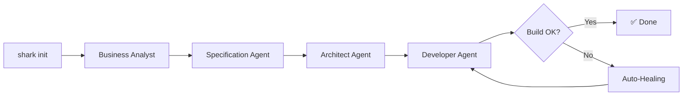

# 🦈 Shark AI

<div align="center">

```
⠀⠀⠀⠀⠀⠀⠀⠀⠀⠀⠀⠀⠀⠀⠀⠀⠀⠀⠀⠀⠀⠀⠀⠀⠀⠀⠀⠀⣠⣄⠀⠀⠀⠀⠀⠀⠀⠀⠀⠀⠀⠀⠀⠀⠀⠀⠀⠀⠀⠀⠀⠀⠀⠀⠀⠀⠀⠀
⠀⠀⠀⠀⠀⠀⠀⠀⠀⠀⠀⠀⠀⠀⠀⠀⠀⠀⠀⠀⠀⠀⠀⠀⠀⠀⣠⣾⣿⣿⠀⠀⠀⠀⠀⠀⠀⠀⠀⠀⠀⠀⠀⠀⠀⠀⠀⠀⠀⠀⠀⠀⠀⠀⠀⠀⠀⠀
⠀⠀⠀⠀⠀⠀⠀⠀⢀⣀⣀⣀⣀⣀⡀⠀⠀⠀⠀⠀⠀⠀⠀⠀⠀⣰⣿⣿⣿⣿⠀⠀⠀⠀⠀⠀⠀⠀⠀⠀⠀⠀⠀⠀⠀⠀⠀⠀⠀⠀⠀⠀⠀⠀⠀⠀⠀⠀
⢠⣾⣿⣏⠉⠉⠉⠉⠉⠉⢡⣶⡀⠀⠀⠀⠀⠀⠀⠀⠀⠀⠀⠀⠘⠻⢿⣿⣿⣿⡀⠀⠀⠀⠀⠀⠀⠀⠀⠀⠀⠀⠀⠀⠀⠀⠀⠀⠀⠀⠀⠀⠀⠀⢀⣤⡄⠀
⠈⣿⣿⣿⣿⣦⣽⣦⡀⠀⠀⠛⠁⠀⠀⠀⠀⠀⠀⠀⠀⠀⠀⠀⠀⠀⠀⠀⠉⠛⢧⡀⠀⠀⠀⠀⠀⠀⠀⠀⠀⠀⠀⠀⠀⠀⠀⠀⠀⠀⠀⠀⠀⣠⣿⣿⠀⠀
⠀⠘⢿⣿⣿⣿⣿⣿⣿⣦⣄⣀⠀⠀⠀⠀⠀⠀⠀⠀⠀⠀⠀⠀⠀⠀⠀⠀⠀⠀⠀⠀⠀⠀⠀⠀⠀⠀⠀⠀⠀⠀⠀⠀⠀⠀⠀⠀⠀⠀⠀⢀⣾⣿⣿⠇⠀⠀
⠀⠀⠈⠻⣿⣿⣿⣿⡟⢿⠻⠛⠙⠉⠋⠛⠳⠀⠀⠀⠀⠀⠀⠀⠀⠀⠀⠀⠀⠀⠀⠀⠀⠀⠀⠀⠀⠀⠀⠀⠀⠀⠀⠀⠀⠀⠀⠀⠀⠀⣠⣿⣿⣿⡟⠀⠀⠀
⠀⠀⠀⠀⠈⠙⢿⡇⣠⣤⣶⣶⣾⡉⠉⠁⠀⠀⠀⠀⠀⠀⠀⠀⠀⣰⣰⡀⠀⠀⠀⠀⠀⠀⠀⠀⠀⠀⠀⠀⠀⠠⠾⢇⠀⠀⠀⠀⠀⣴⣿⣿⣿⣿⠃⠀⠀⠀
⠀⠀⠀⠀⠀⠀⠀⠱⣿⣿⣿⣿⣿⣿⣦⡀⠀⠀⠀⠀⠀⠀⠀⠀⣰⣿⣿⡇⠀⠀⠀⠀⠀⠀⠀⠀⠀⠐⠤⢤⣀⣀⣀⣀⣀⣀⣠⣤⣤⣤⣬⣭⣿⣿⠀⠀⠀⠀
⠀⠀⠀⠀⠀⠀⠀⠀⠈⠛⢿⣿⣿⣿⣿⣿⣶⣤⣄⣀⣀⣠⣴⣾⣿⣿⣿⣷⣤⣀⡀⠀⠀⠀⠀⠀⠀⣀⣀⣤⣾⣿⣿⣿⣿⡿⠿⠛⠛⠻⣿⣿⣿⣿⣇⠀⠀⠀
⠀⠀⠀⠀⠀⠀⠀⠀⠀⠀⠀⠈⠙⠻⣿⣿⣿⣿⣿⣿⣿⣿⣿⣿⣿⣿⣿⣿⣿⣿⣿⣿⣶⣶⣤⣤⣘⡛⠿⢿⡿⠟⠛⠉⠁⠀⠀⠀⠀⠀⠈⠻⣿⣿⣿⣦⠀⠀
⠀⠀⠀⠀⠀⠀⠀⠀⠀⠀⠀⠀⣴⣾⣿⣿⣿⣿⣿⣿⣿⣿⣿⣿⣿⣿⣿⣿⣿⣿⣿⣿⠿⢿⣿⣿⣿⣿⣿⣶⣦⣤⣀⡀⠀⠀⠀⠀⠀⠀⠀⠀⠈⠻⣿⣿⡄⠀
⠀⠀⠀⠀⠀⠀⠀⠀⠀⠀⢠⣾⣿⣿⣿⠿⠛⠉⠁⠀⠈⠉⠙⠛⠛⠻⠿⠿⠿⠿⠟⠛⠃⠀⠀⠀⠉⠉⠉⠛⠛⠛⠿⠿⠿⣶⣦⣄⡀⠀⠀⠀⠀⠀⠈⠙⠛⠂
⠀⠀⠀⠀⠀⠀⠀⠀⠀⠠⠿⠛⠋⠁⠀⠀⠀⠀⠀⠀⠀⠀⠀⠀⠀⠀⠀⠀⠀⠀⠀⠀⠀⠀⠀⠀⠀⠀⠀⠀⠀⠀⠀⠀⠀⠀⠀⠉⠉⠁⠀⠀⠀⠀⠀⠀⠀⠀

   ____  _   _   _    ____  _  __      _    ___ 
  / ___|| | | | / \  |  _ \| |/ /     / \  |_ _|
  \___ \| |_| |/ _ \ | |_) | ' /     / _ \  | | 
   ___) |  _  / ___ \|  _ <| . \    / ___ \ | | 
  |____/|_| |_/_/   \_\_| \_\_|\_\  /_/   \_\___|
                                                  
  AI-Native Collaborative Development Tool

```

**AI-Native Collaborative Development Tool**

*Transform AI chaos into a structured and transparent process*

[](https://www.npmjs.com/package/shark-ai)
[](https://opensource.org/licenses/MIT)
[](https://nodejs.org/)

**English** | [Português](./README.md)

</div>

---

## 🎯 What is Shark AI?

**Shark AI** is an open-source command-line tool that elevates AI-assisted development to a new level through a **collaborative, structured, and persistent workflow**.

Shark AI **amplifies your capabilities** by orchestrating a pipeline of specialized agents (Business Analyst, Specification, Architect, Developer) natively integrated with **StackSpot AI**, keeping you always in control of critical decisions.

### 💡 Inspiration: BMAD Method

The heart of Shark AI is inspired by **[BMAD (Business Model Agile Development)](https://github.com/bmad-method)** - a structured methodology for agile development with AI. Shark AI adapts BMAD principles to create a CLI that keeps developers in control while AI does the heavy lifting.

---

## ✨ Key Features

### 🤝 Smart Human-in-the-Loop
Structured collaboration where **you approve** critical architecture and design decisions while AI executes repetitive tasks.

### 📁 State Persistence
Maintains a living workflow file (`shark-workflow.json`) that tracks progress step by step. **Pause and resume** work between sessions without losing context.

### 🔗 StackSpot AI Native Integration
Direct access to **Knowledge Sources** and company standards, ensuring generated code automatically follows corporate guidelines.

### 🔄 Real Auto-Healing
Autonomous feedback loops that run builds, detect errors, and **automatically fix them** (up to 5 attempts) before requesting your intervention.

### 🎨 Rich Terminal Interface
TUI (Text User Interface) with interactive menus, colors, spinners, and visual feedback for a premium terminal experience.

### 🧠 Multi-Agent Orchestration
Complete development pipeline:
```
Business Analyst → Specification → Architecture → Development
```

---

## 🚀 Installation

```bash
npm install -g shark-ai
```

**Requirements:**
- Node.js >= 20.0.0
- StackSpot AI Account (for authentication)

---

## ⚡ Quick Start

### 1. Authenticate with StackSpot

```bash
shark login
```

Your browser will open automatically for OAuth authentication. Tokens are securely stored in your operating system keychain.

### 2. Initialize a Project

```bash
shark init
```

Shark AI will ask:
- Which stack are you using? (React, Next.js, Angular)
- New workflow or continue existing?
- What do you want to build?

### 3. Let the Agents Work

Shark will automatically orchestrate:

1. **Business Analyst Agent** → Understands your requirements and creates a briefing
2. **Specification Agent** → Transforms briefing into technical specification
3. **Architect Agent** → Designs the solution architecture
4. **Developer Agent** → Generates code and runs tests

**You approve each critical step.** AI executes, you decide.

### 4. Auto-Healing in Action

If there are build or lint errors, Shark:
1. Automatically runs build/test
2. Captures the error (stderr)
3. Sends it to Developer Agent to fix
4. Tries again (up to 5x)
5. If it fails, asks for your help

---

## 📚 Available Commands

### `shark login`
Authenticates with StackSpot AI via OAuth 2.0.

```bash
shark login
```

### `shark init`
Initializes a new workflow or resumes an existing one.

```bash
shark init
```

Shark automatically detects if there's a workflow in progress and offers options to:
- Continue where you left off
- Start a new workflow
- View current progress

### `shark config`
Manages Shark AI global settings.

```bash
shark config
```

Opens an interactive menu to configure:
- API tokens
- Interface preferences
- Default project settings

### `shark ba`
Starts an interactive session with the **Business Analyst Agent**.

```bash
shark ba
```

Use when you want to:
- Refine business requirements
- Create detailed briefings
- Validate acceptance criteria

### `shark spec`
Starts the **Specification Agent** to create technical specifications.

```bash
shark spec [--briefing <path>]
```

**Options:**
- `--briefing`: Path to existing briefing file
- `--id`: Custom agent ID

### `shark dev`
Activates the **Developer Agent** for code generation.

```bash
shark dev
```

### `shark qa`
Runs the **QA Agent** for testing and validation.

```bash
shark qa
```

### `shark scan`
Scans the current project and analyzes its structure.

```bash
shark scan
```

---

## 🎯 Use Cases

### 👨‍💼 Carlos - Senior Developer
**Situation:** Needs to create a complex financial statement module but was interrupted for a meeting.

**With Shark AI:**
1. Starts `shark init`, describes the module
2. Approves architecture proposed by Architect Agent
3. **Leaves for meeting** (closes terminal)
4. Returns 2 hours later, runs `shark init` again
5. **Shark resumes exactly where it left off** - zero context lost
6. Developer Agent completes implementation

**Result:** Module ready in < 1 hour of real work vs 4-6 hours manually.

### 👩‍💻 Julia - Junior Developer
**Situation:** First time optimizing dashboard performance.

**With Shark AI:**
1. `shark ba` - Business Analyst explains performance metrics (LCP, FID)
2. `shark spec` - Specification Agent defines measurable targets
3. During development, Auto-Healing fixes an infinite loop in `useEffect`
4. **Julia learns** by reading diffs and AI explanations

**Result:** Optimized feature + real learning about Web Vitals.

### 👩‍💼 Ana - Tech Lead
**Situation:** Ensure entire team follows new backend standards.

**With Shark AI:**
1. Updates "Backend Standards" document in StackSpot Knowledge Source
2. **Doesn't need to notify anyone**
3. When Carlos and Julia run Shark, agents consult updated Knowledge Source
4. Generated code already follows new standards

**Result:** 100% compliance + PRs approved quickly.

---

## 🏗️ Architecture

### Agent Pipeline


```mermaid
graph LR
    A[shark init] --> B[Business Analyst]
    B --> C[Specification Agent]
    C --> D[Architect Agent]
    D --> E[Developer Agent]
    E --> F{Build OK?}
    F -->|Yes| G[✅ Done]
    F -->|No| H[Auto-Healing]
    H --> E
```

### State Persistence

The `shark-workflow.json` file stores:
- History of all decisions
- Current pipeline state
- Artifacts generated by each agent
- Session context

**You can pause and resume at any time.**

### StackSpot Integration

```
┌─────────────┐
│  Shark CLI  │
└──────┬──────┘
       │
       ├──► StackSpot AI API
       │    (Agents)
       │
       └──► Knowledge Sources
            (Company Standards)
```

---

## 🔒 Security

- ✅ **Tokens securely stored** using OS keychain
- ✅ **Zero code leakage** - communication restricted to StackSpot API (SOC2 compliant)
- ✅ **Sensitive files protected** - `.gitignore` configured to prevent committing secrets
- ✅ **OAuth 2.0** for secure authentication

---

## 🤝 Contributing

Contributions are welcome! See [CONTRIBUTING.md](./CONTRIBUTING.md) for details on:
- How to report bugs
- How to suggest features
- Pull Request process
- Coding standards

---

## 📝 Changelog

See [CHANGELOG.md](./CHANGELOG.md) for version history and changes.

---

## 📄 License

This project is licensed under the MIT License - see the [LICENSE](./LICENSE) file for details.

---

## 💬 Support

- **Issues:** [GitHub Issues](https://github.com/miguelarcjr/shark-ai/issues)
- **Discussions:** [GitHub Discussions](https://github.com/miguelarcjr/shark-ai/discussions)

---

## 🙏 Acknowledgments

- **[BMAD Method](https://github.com/bmad-method)** - Methodological inspiration
- **[StackSpot AI](https://stackspot.com)** - AI agents platform
- **Open Source Community** - For making all this possible

---

<div align="center">

**Made with ❤️ by [Miguel Arcangelo](https://github.com/miguelarcjr)**

If Shark AI helped you, consider giving the project a ⭐!

</div>
