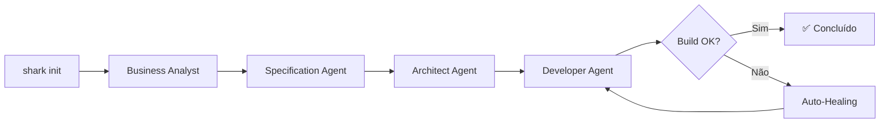

# 🦈 Shark AI

<div align="center">

```
⠀⠀⠀⠀⠀⠀⠀⠀⠀⠀⠀⠀⠀⠀⠀⠀⠀⠀⠀⠀⠀⠀⠀⠀⠀⠀⠀⠀⣠⣄⠀⠀⠀⠀⠀⠀⠀⠀⠀⠀⠀⠀⠀⠀⠀⠀⠀⠀⠀⠀⠀⠀⠀⠀⠀⠀⠀⠀
⠀⠀⠀⠀⠀⠀⠀⠀⠀⠀⠀⠀⠀⠀⠀⠀⠀⠀⠀⠀⠀⠀⠀⠀⠀⠀⣠⣾⣿⣿⠀⠀⠀⠀⠀⠀⠀⠀⠀⠀⠀⠀⠀⠀⠀⠀⠀⠀⠀⠀⠀⠀⠀⠀⠀⠀⠀⠀
⠀⠀⠀⠀⠀⠀⠀⠀⢀⣀⣀⣀⣀⣀⡀⠀⠀⠀⠀⠀⠀⠀⠀⠀⠀⣰⣿⣿⣿⣿⠀⠀⠀⠀⠀⠀⠀⠀⠀⠀⠀⠀⠀⠀⠀⠀⠀⠀⠀⠀⠀⠀⠀⠀⠀⠀⠀⠀
⢠⣾⣿⣏⠉⠉⠉⠉⠉⠉⢡⣶⡀⠀⠀⠀⠀⠀⠀⠀⠀⠀⠀⠀⠘⠻⢿⣿⣿⣿⡀⠀⠀⠀⠀⠀⠀⠀⠀⠀⠀⠀⠀⠀⠀⠀⠀⠀⠀⠀⠀⠀⠀⠀⢀⣤⡄⠀
⠈⣿⣿⣿⣿⣦⣽⣦⡀⠀⠀⠛⠁⠀⠀⠀⠀⠀⠀⠀⠀⠀⠀⠀⠀⠀⠀⠀⠉⠛⢧⡀⠀⠀⠀⠀⠀⠀⠀⠀⠀⠀⠀⠀⠀⠀⠀⠀⠀⠀⠀⠀⠀⣠⣿⣿⠀⠀
⠀⠘⢿⣿⣿⣿⣿⣿⣿⣦⣄⣀⠀⠀⠀⠀⠀⠀⠀⠀⠀⠀⠀⠀⠀⠀⠀⠀⠀⠀⠀⠀⠀⠀⠀⠀⠀⠀⠀⠀⠀⠀⠀⠀⠀⠀⠀⠀⠀⠀⠀⢀⣾⣿⣿⠇⠀⠀
⠀⠀⠈⠻⣿⣿⣿⣿⡟⢿⠻⠛⠙⠉⠋⠛⠳⠀⠀⠀⠀⠀⠀⠀⠀⠀⠀⠀⠀⠀⠀⠀⠀⠀⠀⠀⠀⠀⠀⠀⠀⠀⠀⠀⠀⠀⠀⠀⠀⠀⣠⣿⣿⣿⡟⠀⠀⠀
⠀⠀⠀⠀⠈⠙⢿⡇⣠⣤⣶⣶⣾⡉⠉⠁⠀⠀⠀⠀⠀⠀⠀⠀⠀⣰⣰⡀⠀⠀⠀⠀⠀⠀⠀⠀⠀⠀⠀⠀⠀⠠⠾⢇⠀⠀⠀⠀⠀⣴⣿⣿⣿⣿⠃⠀⠀⠀
⠀⠀⠀⠀⠀⠀⠀⠱⣿⣿⣿⣿⣿⣿⣦⡀⠀⠀⠀⠀⠀⠀⠀⠀⣰⣿⣿⡇⠀⠀⠀⠀⠀⠀⠀⠀⠀⠐⠤⢤⣀⣀⣀⣀⣀⣀⣠⣤⣤⣤⣬⣭⣿⣿⠀⠀⠀⠀
⠀⠀⠀⠀⠀⠀⠀⠀⠈⠛⢿⣿⣿⣿⣿⣿⣶⣤⣄⣀⣀⣠⣴⣾⣿⣿⣿⣷⣤⣀⡀⠀⠀⠀⠀⠀⠀⣀⣀⣤⣾⣿⣿⣿⣿⡿⠿⠛⠛⠻⣿⣿⣿⣿⣇⠀⠀⠀
⠀⠀⠀⠀⠀⠀⠀⠀⠀⠀⠀⠈⠙⠻⣿⣿⣿⣿⣿⣿⣿⣿⣿⣿⣿⣿⣿⣿⣿⣿⣿⣿⣶⣶⣤⣤⣘⡛⠿⢿⡿⠟⠛⠉⠁⠀⠀⠀⠀⠀⠈⠻⣿⣿⣿⣦⠀⠀
⠀⠀⠀⠀⠀⠀⠀⠀⠀⠀⠀⠀⣴⣾⣿⣿⣿⣿⣿⣿⣿⣿⣿⣿⣿⣿⣿⣿⣿⣿⣿⣿⠿⢿⣿⣿⣿⣿⣿⣶⣦⣤⣀⡀⠀⠀⠀⠀⠀⠀⠀⠀⠈⠻⣿⣿⡄⠀
⠀⠀⠀⠀⠀⠀⠀⠀⠀⠀⢠⣾⣿⣿⣿⠿⠛⠉⠁⠀⠈⠉⠙⠛⠛⠻⠿⠿⠿⠿⠟⠛⠃⠀⠀⠀⠉⠉⠉⠛⠛⠛⠿⠿⠿⣶⣦⣄⡀⠀⠀⠀⠀⠀⠈⠙⠛⠂
⠀⠀⠀⠀⠀⠀⠀⠀⠀⠠⠿⠛⠋⠁⠀⠀⠀⠀⠀⠀⠀⠀⠀⠀⠀⠀⠀⠀⠀⠀⠀⠀⠀⠀⠀⠀⠀⠀⠀⠀⠀⠀⠀⠀⠀⠀⠀⠉⠉⠁⠀⠀⠀⠀⠀⠀⠀⠀

   ____  _   _   _    ____  _  __      _    ___ 
  / ___|| | | | / \  |  _ \| |/ /     / \  |_ _|
  \___ \| |_| |/ _ \ | |_) | ' /     / _ \  | | 
   ___) |  _  / ___ \|  _ <| . \    / ___ \ | | 
  |____/|_| |_/_/   \_\_| \_\_|\_\  /_/   \_\___|
                                                  
  AI-Native Collaborative Development Tool

```

**Ferramenta de Desenvolvimento Colaborativo com IA**

*Transforme o desenvolvimento com IA em um processo estruturado e transparente*

[](https://www.npmjs.com/package/shark-ai)
[](https://opensource.org/licenses/MIT)
[](https://nodejs.org/)

[English](./README.en.md) | **Português**

</div>

---

## 🎯 O Que é o Shark AI?

**Shark AI** é uma ferramenta de linha de comando open-source que eleva o desenvolvimento assistido por IA a um novo patamar através de um **workflow colaborativo, estruturado e persistente**.

O Shark AI **amplifica suas capacidades** orquestrando um pipeline de agentes especializados (Business Analyst, Specification, Architect, Developer) integrados nativamente com a **StackSpot AI**, mantendo você sempre no controle das decisões críticas.

### 💡 Inspiração: BMAD Method

O coração do Shark AI é inspirado no **[BMAD (Business Model Agile Development)](https://github.com/bmad-method)** - uma metodologia estruturada para desenvolvimento ágil com IA. O Shark AI adapta os princípios do BMAD para criar um CLI que mantém o desenvolvedor no controle enquanto a IA executa o trabalho pesado.

---

## ✨ Features Principais

### 🤝 Human-in-the-Loop Inteligente
Colaboração estruturada onde **você aprova** as decisões críticas de arquitetura e design, enquanto a IA executa tarefas repetitivas.

### 📁 Persistência de Estado
Mantém um arquivo de workflow vivo (`shark-workflow.json`) que rastreia o progresso passo a passo. **Pause e retome** o trabalho entre sessões sem perder contexto.

### 🔗 Integração Nativa StackSpot AI
Acesso direto a **Knowledge Sources** e padrões da empresa, garantindo que o código gerado siga automaticamente as diretrizes corporativas.

### 🔄 Auto-Healing Real
Loops de feedback autônomos que executam builds, detectam erros e **corrigem automaticamente** (até 5 tentativas) antes de solicitar sua intervenção.

### 🎨 Interface de Terminal Rica
TUI (Text User Interface) com menus interativos, cores, spinners e feedback visual para uma experiência premium no terminal.

### 🧠 Orquestração Multi-Agente
Pipeline completo de desenvolvimento:
```
Business Analyst → Specification → Architecture → Development
```

---

## 🚀 Instalação

```bash
npm install -g shark-ai
```

**Requisitos:**
- Node.js >= 20.0.0
- Conta StackSpot AI (para autenticação)

---

## ⚡ Quick Start

### 1. Autentique com StackSpot

```bash
shark login
```

O navegador abrirá automaticamente para autenticação OAuth. Seus tokens serão armazenados de forma segura no sistema operacional.

### 2. Inicialize um Projeto

```bash
shark init
```

O Shark AI perguntará:
- Qual stack você está usando? (React, Next.js, Angular)
- Novo workflow ou continuar existente?
- O que você quer construir?

### 3. Deixe os Agentes Trabalharem

O Shark orquestrará automaticamente:

1. **Business Analyst Agent** → Entende seus requisitos e cria um briefing
2. **Specification Agent** → Transforma o briefing em especificação técnica
3. **Architect Agent** → Projeta a arquitetura da solução
4. **Developer Agent** → Gera o código e executa testes

**Você aprova cada etapa crítica.** A IA executa, você decide.

### 4. Auto-Healing em Ação

Se houver erros de build ou lint, o Shark:
1. Executa o build/test automaticamente
2. Captura o erro (stderr)
3. Envia para o Developer Agent corrigir
4. Tenta novamente (até 5x)
5. Se falhar, pede sua ajuda

---

## 📚 Comandos Disponíveis

### `shark login`
Autentica com StackSpot AI via OAuth 2.0.

```bash
shark login
```

### `shark init`
Inicializa um novo workflow ou retoma um existente.

```bash
shark init
```

O Shark detecta automaticamente se há um workflow em andamento e oferece opções para:
- Continuar de onde parou
- Iniciar um novo workflow
- Visualizar o progresso atual

### `shark config`
Gerencia configurações globais do Shark AI.

```bash
shark config
```

Abre um menu interativo para configurar:
- Tokens de API
- Preferências de interface
- Configurações padrão de projeto

### `shark ba`
Inicia uma sessão interativa com o **Business Analyst Agent**.

```bash
shark ba
```

Use quando quiser:
- Refinar requisitos de negócio
- Criar briefings detalhados
- Validar critérios de aceitação

### `shark spec`
Inicia o **Specification Agent** para criar especificações técnicas.

```bash
shark spec [--briefing <caminho>]
```

**Opções:**
- `--briefing`: Caminho para arquivo de briefing existente
- `--id`: ID customizado do agente

### `shark dev`
Ativa o **Developer Agent** para geração de código.

```bash
shark dev
```

### `shark qa`
Executa o **QA Agent** para testes e validação.

```bash
shark qa
```

### `shark scan`
Escaneia o projeto atual e analisa a estrutura.

```bash
shark scan
```

---

## 🎯 Casos de Uso

### 👨‍💼 Carlos - Senior Developer
**Situação:** Precisa criar um módulo de extrato financeiro complexo mas foi interrompido para uma reunião.

**Com Shark AI:**
1. Inicia `shark init`, descreve o módulo
2. Aprova a arquitetura proposta pelo Architect Agent
3. **Sai para a reunião** (fecha o terminal)
4. Volta 2 horas depois, roda `shark init` novamente
5. **Shark retoma exatamente de onde parou** - zero contexto perdido
6. Developer Agent completa a implementação

**Resultado:** Módulo pronto em < 1 hora de trabalho real vs 4-6 horas manual.

### 👩‍💻 Julia - Junior Developer
**Situação:** Primeira vez otimizando performance de um dashboard.

**Com Shark AI:**
1. `shark ba` - O Business Analyst explica métricas de performance (LCP, FID)
2. `shark spec` - Specification Agent define alvos mensuráveis
3. Durante desenvolvimento, Auto-Healing corrige um loop infinito no `useEffect`
4. **Julia aprende** lendo os diffs e explicações da IA

**Resultado:** Feature otimizada + aprendizado real sobre Web Vitals.

### 👩‍💼 Ana - Tech Lead
**Situação:** Garantir que toda a equipe siga novos padrões de backend.

**Com Shark AI:**
1. Atualiza documento "Backend Standards" no StackSpot Knowledge Source
2. **Não precisa avisar ninguém**
3. Quando Carlos e Julia rodam Shark, os agentes consultam o Knowledge Source atualizado
4. Código gerado já nasce seguindo os novos padrões

**Resultado:** Compliance 100% + PRs aprovados rapidamente.

---

## 🏗️ Arquitetura

### Pipeline de Agentes



### Persistência de Estado

O arquivo `shark-workflow.json` armazena:
- Histórico de todas as decisões
- Estado atual do pipeline
- Artefatos gerados por cada agente
- Contexto da sessão

**Você pode pausar e retomar a qualquer momento.**

### Integração StackSpot

```
┌─────────────┐
│  Shark CLI  │
└──────┬──────┘
       │
       ├──► StackSpot AI API
       │    (Agentes)
       │
       └──► Knowledge Sources
            (Padrões da Empresa)
```

---

## 🔒 Segurança

- ✅ **Tokens armazenados de forma segura** usando keychain do SO
- ✅ **Zero vazamento de código** - comunicação restrita à API StackSpot (SOC2 compliant)
- ✅ **Arquivos sensíveis protegidos** - `.gitignore` configurado para prevenir commit de secrets
- ✅ **OAuth 2.0** para autenticação segura

---

## 🤝 Contribuindo

Contribuições são bem-vindas! Veja [CONTRIBUTING.md](./CONTRIBUTING.md) para detalhes sobre:
- Como reportar bugs
- Como sugerir features
- Processo de Pull Request
- Coding standards

---

## 📝 Changelog

Veja [CHANGELOG.md](./CHANGELOG.md) para histórico de versões e mudanças.

---

## 📄 Licença

Este projeto está licenciado sob a Licença MIT - veja o arquivo [LICENSE](./LICENSE) para detalhes.

---

## 💬 Suporte

- **Issues:** [GitHub Issues](https://github.com/miguelarcjr/shark-ai/issues)
- **Discussões:** [GitHub Discussions](https://github.com/miguelarcjr/shark-ai/discussions)

---

## 🙏 Agradecimentos

- **[BMAD Method](https://github.com/bmad-method)** - Inspiração metodológica
- **[StackSpot AI](https://stackspot.com)** - Plataforma de agentes de IA
- **Comunidade Open Source** - Por tornar tudo isso possível

---

<div align="center">

**Feito com ❤️ por [Miguel Arcangelo](https://github.com/miguelarcjr)**

Se o Shark AI te ajudou, considere dar uma ⭐ no projeto!

</div>
