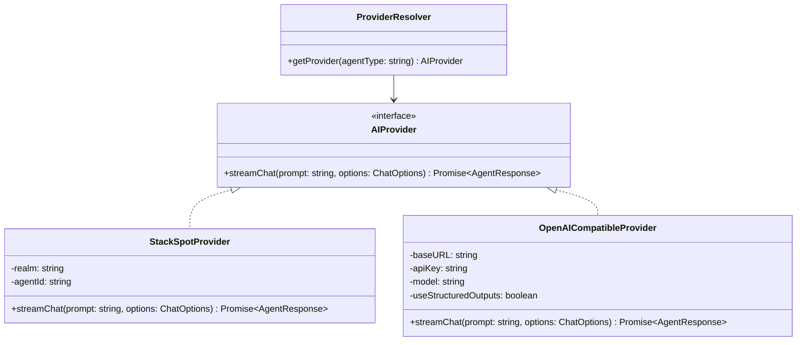

# Technical Spec: Multi-Provider Refactoring for Shark AI

## Goal
Enable Shark AI to be used by any developer (not restricted to private enterprise environments) by supporting alternative AI/LLM providers—specifically cloud APIs (OpenAI, Gemini, DeepSeek, OpenRouter) and local models (Ollama, LM Studio)—while maintaining full backward compatibility with the current StackSpot AI implementation.

---

## Architecture Design

We will introduce the **Adapter/Strategy Pattern** to decouple the agent logic from the concrete LLM client. 



### 1. Unified Interface: `AIProvider`

Create a new file `src/core/api/provider.interface.ts`:
```typescript
import { AgentResponse } from '../agents/agent-response-parser.js';

export interface ChatOptions {
    onChunk?: (chunk: string) => void;
    onComplete?: (response: AgentResponse) => void;
    conversationId?: string;
    agentType: 'business_analyst' | 'developer_agent' | 'qa_agent' | 'specification_agent' | 'scan_agent';
}

export interface AIProvider {
    streamChat(prompt: string, options: ChatOptions): Promise<AgentResponse>;
}
```

### 2. Concrete Implementations

- **`StackSpotProvider`** (in `src/core/api/stackspot-provider.ts`):
  - Wraps the existing StackSpot authentication (`ensureValidToken`, `tokenStorage`) and Server-Sent Events (SSE) logic.
  - Queries `STACKSPOT_AGENT_API_BASE` using the server-provided `conversationId`.
  - Backward compatibility: If no provider is configured, the system defaults to this.

- **`OpenAICompatibleProvider`** (in `src/core/api/openai-compatible-provider.ts`):
  - Connects to standard `/v1/chat/completions` endpoints (e.g., OpenRouter, Ollama, OpenAI).
  - Manages session history locally via the `HistoryManager` using a local UUID session ID.
  - Sends the **Base System Prompt** (defining JSON schema and tool execution guidelines) combined with the **Agent System Prompt** as the `system` message.
  - Leverages **Structured Outputs (JSON Schema)** parameter when supported.

---

## Conversation History & Session Management

To align the stateless nature of standard `/v1/chat/completions` APIs with StackSpot's stateful server-side conversation threads, we introduce a **Unified Session ID** model.

### 1. Unified Session IDs
- **StackSpot**: The `conversationId` is the UUID string returned from StackSpot's server.
- **Alternative Providers**: The CLI generates a local UUID (e.g. using `crypto.randomUUID()`) when starting a new conversation and saves it under `conversations[agentType]` in the workflow state.

### 2. Local History Storage (`HistoryManager`)
We will create `src/core/workflow/history-manager.ts` to persist dialogue histories locally for alternative providers:
- **Storage Path**: `_sharkrc/history/[conversationId].json`
- **Format**: Standard OpenAI message array:
  ```json
  [
    { "role": "system", "content": "..." },
    { "role": "user", "content": "..." },
    { "role": "assistant", "content": "..." }
  ]
  ```
- **Flow**:
  1. The agent requests a response.
  2. `OpenAICompatibleProvider` checks if a local `conversationId` exists. If not, it generates one.
  3. It reads the historical messages from `_sharkrc/history/[conversationId].json` (if the file exists).
  4. Appends the new user prompt.
  5. Sends the complete list to the target API.
  6. Upon completion, appends the assistant's response to the array and writes it back to the JSON file.

---

## Format Constraints & Fallback Strategy

For alternative providers, we must supply the format constraints. Because models vary in their support for strict API-level format enforcement (especially free tier models like Nemotron on OpenRouter or local models via Ollama), we implement a **three-level format enforcement strategy**:

1. **Level 1: Strict JSON Schema (`json_schema`)**
   - If `useStructuredOutputs` is `true` in configuration, the client adds:
     `"response_format": { "type": "json_schema", "json_schema": { "strict": true, "schema": ... } }`
   - Enforces exact structure matching `AgentResponseSchema`. Highly recommended for GPT-4o, Claude 3.5, and Gemini 1.5.

2. **Level 2: Basic JSON Object (`json_object`)**
   - If the target model does not support strict schemas but supports JSON mode, the client sends:
     `"response_format": { "type": "json_object" }`
   - Prompt instructions guide the structure, and the LLM guarantees a syntactically valid JSON output.

3. **Level 3: Raw Text + Tolerant Parsing (Tolerant Fallback)**
   - If `response_format` is disabled/unsupported, the client makes a standard request.
   - The CLI uses `extractFirstJson()` (from `agent-response-parser.ts`) to extract the balanced JSON block from the LLM's response, even if surrounded by markdown code fences or conversational text.
   - If JSON parsing fails entirely, it wraps the response in a `talk_with_user` action block to prevent crashes.

---

## Configuration Updates (`shark.json` / `.sharkrc`)

We will expand the configuration schema in `src/core/config-manager.ts` to support the new providers.

```json
{
  "provider": "openai-compatible",
  "openai-compatible": {
    "baseURL": "https://openrouter.ai/api/v1",
    "apiKey": "sk-or-...",
    "model": "meta-llama/llama-3-8b-instruct:free",
    "useStructuredOutputs": true
  },
  "agents": {
    "ba": "01KEJ95G304TNNAKGH5XNEEBVD",
    "dev": "01KEQCGJ65YENRA4QBXVN1YFFX"
  }
}
```

### Resolver logic (`src/core/api/provider-resolver.ts`):
```typescript
import { ConfigManager } from '../config-manager.js';
import { AIProvider } from './provider.interface.js';
import { StackSpotProvider } from './stackspot-provider.js';
import { OpenAICompatibleProvider } from './openai-compatible-provider.js';

export class ProviderResolver {
    static getProvider(agentType: string): AIProvider {
        const config = ConfigManager.getInstance().getConfig();
        
        if (config.provider === 'openai-compatible') {
            const opt = config['openai-compatible'] || {};
            return new OpenAICompatibleProvider({
                baseURL: opt.baseURL || 'http://localhost:11434/v1',
                apiKey: opt.apiKey || 'ollama',
                model: opt.model || 'llama3',
                useStructuredOutputs: opt.useStructuredOutputs ?? true
            });
        }
        
        // Default / Fallback to StackSpot
        return new StackSpotProvider(agentType);
    }
}
```

---

## Implementation Plan

1. **Setup Interfaces**: Create `provider.interface.ts` and `provider-resolver.ts`.
2. **Move StackSpot Logic**: Relocate current token authentication/SSE code from `business-analyst-agent.ts` and `developer-agent.ts` to `StackSpotProvider`.
3. **Build History Manager**: Implement `history-manager.ts` to manage reading/writing of localized conversation JSON files by UUID.
4. **Build OpenAI Compatible Provider**: Implement SSE stream parsing for standard OpenAI JSON formats, history loading, and JSON Schema constraints.
5. **Integrate Prompts**: Define standard agent personalities locally and prepend them to the request context for alternative providers.
6. **Update Agents**: Refactor the agents to use `ProviderResolver.getProvider(...)` instead of direct StackSpot endpoints.
7. **Config Support**: Update configuration manager and validation schemas to accept multi-provider configurations.
8. **Verification & Tests**: Verify with existing test suites and write unit tests for the providers.
