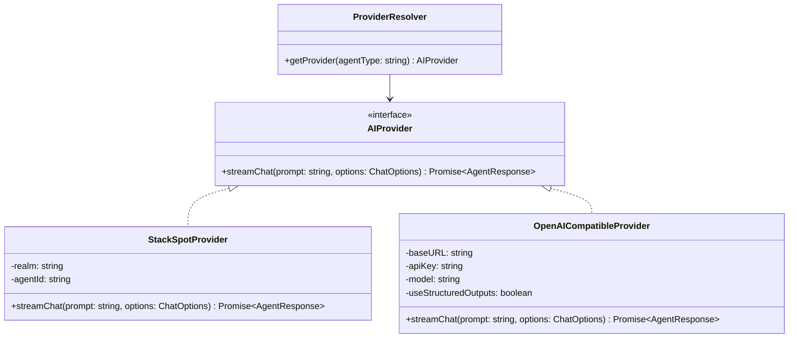

# Technical Spec: Multi-Provider Refactoring for Shark AI

## Goal
Enable Shark AI to be used by any developer (not restricted to private enterprise environments) by supporting alternative AI/LLM providers—specifically cloud APIs (OpenAI, Gemini, DeepSeek, OpenRouter) and local models (Ollama, LM Studio)—while maintaining full backward compatibility with the current StackSpot AI implementation.

---

## Architecture Design

We will introduce the **Adapter/Strategy Pattern** to decouple the agent logic from the concrete LLM client. 



### 1. Unified Interface: `AIProvider`

Create a new file `src/core/api/provider.interface.ts`:
```typescript
import { AgentResponse } from '../agents/agent-response-parser.js';

export interface ChatOptions {
    onChunk?: (chunk: string) => void;
    onComplete?: (response: AgentResponse) => void;
    conversationId?: string;
    agentType: 'business_analyst' | 'developer_agent' | 'qa_agent' | 'specification_agent' | 'scan_agent';
}

export interface AIProvider {
    streamChat(prompt: string, options: ChatOptions): Promise<AgentResponse>;
}
```

### 2. Concrete Implementations

- **`StackSpotProvider`** (in `src/core/api/stackspot-provider.ts`):
  - Wraps the existing StackSpot authentication (`ensureValidToken`, `tokenStorage`) and Server-Sent Events (SSE) logic.
  - Queries `STACKSPOT_AGENT_API_BASE`.
  - Backward compatibility: If no provider is configured, the system defaults to this.

- **`OpenAICompatibleProvider`** (in `src/core/api/openai-compatible-provider.ts`):
  - Connects to standard `/v1/chat/completions` endpoints.
  - Supports custom base URLs, enabling connection to:
    - **OpenRouter**: `https://openrouter.ai/api/v1`
    - **Ollama (local)**: `http://localhost:11434/v1`
    - **OpenAI**: `https://api.openai.com/v1`
    - **DeepSeek**: `https://api.deepseek.com/v1`
  - Sends the **Base System Prompt** (defining JSON schema and tool execution guidelines) combined with the **Agent System Prompt** as the `system` message.
  - Leverages **Structured Outputs (JSON Schema)** parameter when supported (using a strict schema mapping for `AgentResponseSchema`).

---

## System Prompt and Structured Outputs

For alternative providers, we must supply the system prompt and tool definitions directly since they lack StackSpot's server-side portal configurations.

### Base System Prompt (`BASE_SYSTEM_PROMPT`)
Forces the LLM to output only JSON matches for `AgentResponseSchema` and defines the terminal actions:
- `create_file`, `modify_file`, `read_file`, `list_files`, `search_code`, `run_command`, `talk_with_user`, `delete_file`

### Zod Schema to JSON Schema Mapping
For models supporting structured outputs, the client sends the schema constraint dynamically to ensure that output matches `AgentResponseSchema` without format failures.

---

## Configuration Updates (`shark.json` / `.sharkrc`)

We will expand the configuration schema in `src/core/config-manager.ts` to support the new providers.

```json
{
  "provider": "openai-compatible",
  "openai-compatible": {
    "baseURL": "https://openrouter.ai/api/v1",
    "apiKey": "sk-or-...",
    "model": "meta-llama/llama-3-8b-instruct:free",
    "useStructuredOutputs": true
  },
  "agents": {
    "ba": "01KEJ95G304TNNAKGH5XNEEBVD",
    "dev": "01KEQCGJ65YENRA4QBXVN1YFFX"
  }
}
```

### Resolver logic (`src/core/api/provider-resolver.ts`):
```typescript
import { ConfigManager } from '../config-manager.js';
import { AIProvider } from './provider.interface.js';
import { StackSpotProvider } from './stackspot-provider.js';
import { OpenAICompatibleProvider } from './openai-compatible-provider.js';

export class ProviderResolver {
    static getProvider(agentType: string): AIProvider {
        const config = ConfigManager.getInstance().getConfig();
        
        if (config.provider === 'openai-compatible') {
            const opt = config['openai-compatible'] || {};
            return new OpenAICompatibleProvider({
                baseURL: opt.baseURL || 'http://localhost:11434/v1',
                apiKey: opt.apiKey || 'ollama',
                model: opt.model || 'llama3',
                useStructuredOutputs: opt.useStructuredOutputs ?? true
            });
        }
        
        // Default / Fallback to StackSpot
        return new StackSpotProvider(agentType);
    }
}
```

---

## Implementation Plan

1. **Setup Interfaces**: Create `provider.interface.ts` and `provider-resolver.ts`.
2. **Move StackSpot Logic**: Relocate current token authentication/SSE code from `business-analyst-agent.ts` and `developer-agent.ts` to `StackSpotProvider`.
3. **Build OpenAI Compatible Provider**: Implement SSE stream parsing for standard OpenAI JSON formats, including JSON Schema constraints.
4. **Integrate Prompts**: Define standard agent personalities locally and prepend them to the request context for alternative providers.
5. **Update Agents**: Refactor the agents to use `ProviderResolver.getProvider(...)` instead of direct StackSpot endpoints.
6. **Config Support**: Update configuration manager and validation schemas to accept multi-provider configurations.
7. **Verification & Tests**: Verify with existing test suites and write unit tests for the providers.
