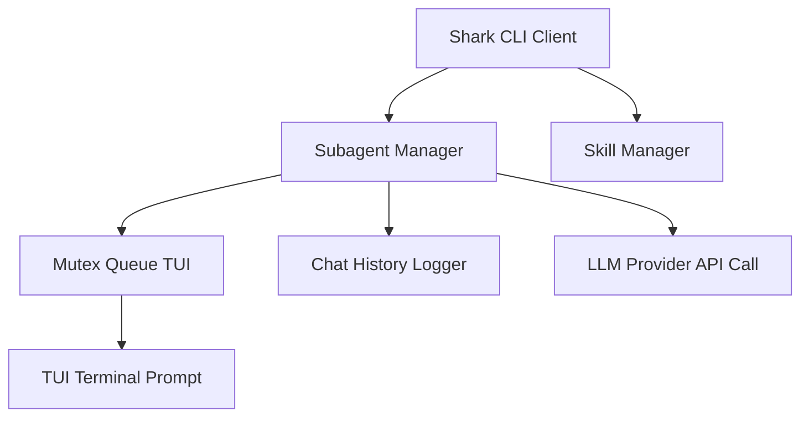

# Technical Specification: Native Superpowers & Subagents Integration in Shark AI

This document specifies the design for adding native support for **Superpowers** (skills and subagents lifecycle management) into the **Shark AI CLI**. 

---

## 1. Core Architecture & TUI Mutex Queue

To support skills and subagents concurrently without introducing heavy inter-process communication (IPC) frameworks, the Shark CLI will run sub-conversations asynchronously in memory.



### Components
1.  **`SubagentManager` (`src/core/workflow/subagent-manager.ts`)**:
    *   Coordinates the execution of subagents.
    *   Maps active `conversationId` to their corresponding Promise chains and history.
2.  **`SkillManager` (`src/core/workflow/skill-manager.ts`)**:
    *   Scans and indexes available skills from local project-level and global user directories.
    *   Loads and parses `SKILL.md` documents to inject instructions into LLM calls.
3.  **`MutexQueueTUI` (`src/ui/tui.ts`)**:
    *   A simple lock-based queue that serializes user input prompts (e.g., `tui.confirm` or `tui.text`) requested by concurrent agents, preventing scrambled terminal outputs.

---

## 2. Skill Loading & `activate_skill` Action

### Agent Response JSON Schema Expansion
A new action type `activate_skill` will be added to the agent response schema:

```json
{
  "action": {
    "type": "activate_skill",
    "skill_name": "brainstorming"
  },
  "summary": "Activating the brainstorming skill to plan the feature."
}
```

### Path Resolution
When a skill is activated, `SkillManager` will resolve the `SKILL.md` path by searching the following locations in order:
1.  **Local Workspace**: `<workspace-root>/.agents/skills/<skill_name>/SKILL.md`
2.  **Global User Home**: `~/.shark/skills/<skill_name>/SKILL.md`

### Injection Protocol
Upon reading the `SKILL.md` file:
1.  Remove the initial YAML frontmatter (between the `---` delimiters).
2.  Prepend the Markdown content inside `<EXTREMELY_IMPORTANT>` tags to the `system` prompt for all subsequent turns in the current active session.
3.  Return a system confirmation chunk to the agent's context on the next iteration:
    `[System]: Skill '<skill_name>' activated successfully. Follow its instructions exactly.`

---

## 3. Subagent Lifecycle & Lifecycle Tools

### Agent Response JSON Schema Expansion
Four new action definitions will be added to the agent response schema:

```typescript
// define_subagent: Register a new specialized agent
{
  "action": {
    "type": "define_subagent",
    "name": "code_reviewer",
    "description": "Reviews TypeScript code against standards",
    "system_prompt": "You are a code reviewer...",
    "enable_write_tools": false,
    "enable_subagent_tools": false
  }
}

// invoke_subagent: Spawn concurrent subagent execution
{
  "action": {
    "type": "invoke_subagent",
    "Subagents": [
      {
        "TypeName": "self",
        "Role": "Code Implementer",
        "Prompt": "Implement the task..."
      }
    ]
  }
}

// send_message: Communicate with another agent
{
  "action": {
    "type": "send_message",
    "Recipient": "conversation-id-abc",
    "Message": "I have completed the code review."
  }
}

// manage_subagents: List or terminate subagents
{
  "action": {
    "type": "manage_subagents",
    "Action": "list" | "kill" | "kill_all",
    "ConversationIds": ["conversation-id-abc"] // Optional
  }
}
```

### Execution Loop
1.  **Read-Only Subagents (e.g. `research`)**: Inherit only read tools (`read_file`, `list_files`, `search_code`, `search_file`). They execute silently in memory and never prompt the user for approvals.
2.  **Write-Enabled Subagents (e.g. `self`)**: Inherit write tools (`modify_file`, `create_file`, `delete_file`, `run_command`). If they call tools requiring approvals, they must acquire the TUI mutex lock before prompting the user.
3.  **Completion & Resumption**:
    *   Subagents terminate their task loop by returning:
        `TASK_COMPLETED: <technical_summary>` or `TASK_FAILED: <error_reason>`.
    *   The `SubagentManager` captures this output, terminates the subagent's promise, and appends a system notification to the parent agent's message history:
        `[Subagent <id> finished with result: <summary>]` or `[Subagent <id> failed: <reason>]`.
    *   The parent agent's execution loop is then reactivated.

---

## 4. `shark super` Setup Command & Packaging

### Package Distribution
1.  The `skills/` directory of the `Superpowers` repository will be bundled inside the `shark-ai` npm package.
2.  The `package.json` file will include `"skills"` in the `"files"` entry to ensure it distributes correctly.

### Setup Logic
A new command `shark super` will copy these files globally:

```typescript
import { fileURLToPath } from 'node:url';
import path from 'node:path';
import os from 'node:os';
import fs from 'node:fs/promises';

export const superCommandAction = async () => {
    // 1. Resolve source path within the installed npm package files
    const __filename = fileURLToPath(import.meta.url);
    const __dirname = path.dirname(__filename);
    const packageRoot = path.resolve(__dirname, '../../');
    const internalSkillsPath = path.join(packageRoot, 'skills');

    // 2. Resolve target global path in home directory
    const globalSkillsPath = path.join(os.homedir(), '.shark', 'skills');

    try {
        // 3. Create target directory and copy files recursively
        await fs.mkdir(globalSkillsPath, { recursive: true });
        await fs.cp(internalSkillsPath, globalSkillsPath, { recursive: true });
        console.log(`🚀 Superpowers skills installed successfully to ${globalSkillsPath}`);
    } catch (error: any) {
        console.error(`❌ Failed to install superpowers skills: ${error.message}`);
        process.exit(1);
    }
};
```
