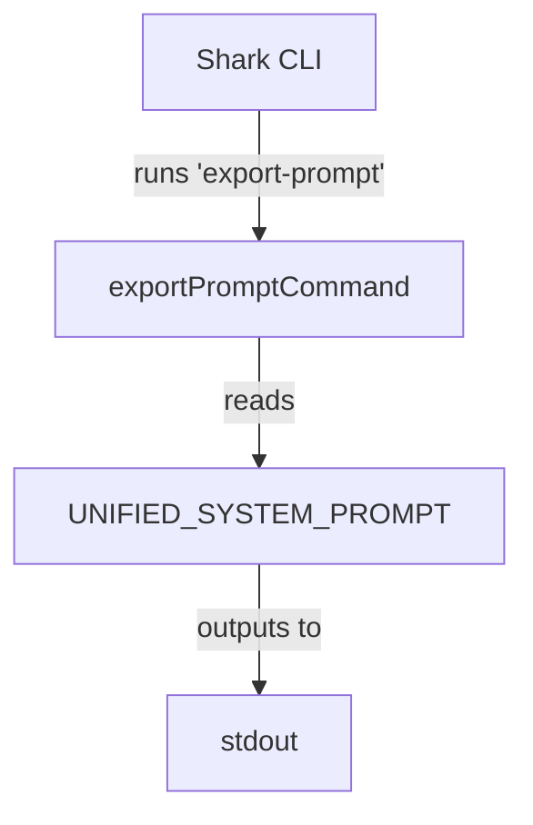

# Design Spec: Export Prompt Command

**Date:** 2026-06-19  
**Goal:** Add a new CLI command to export the unified agent system prompt, making it easy to copy or automate updates to the StackSpot AI platform.

---

## 1. Requirements

- Add a command named `export-prompt` to the Shark CLI.
- When executed, the command must output the exact, current `UNIFIED_SYSTEM_PROMPT` to standard output.
- Follow TDD: write a failing test first, verify failure, implement, and verify success.
- Integrate with existing CLI commands.

---

## 2. Architecture & Design



### Proposed Files

1. **`src/commands/export-prompt.ts`**: Implements the Commander CLI command using `UNIFIED_SYSTEM_PROMPT`.
2. **`src/commands/export-prompt.test.ts`**: Tests that the command prints the exact prompt to stdout.
3. **`src/bin/shark.ts`**: Imports and registers the new command.

---

## 3. Implementation Details

### Command implementation (`src/commands/export-prompt.ts`)

```typescript
import { Command } from 'commander';
import { UNIFIED_SYSTEM_PROMPT } from '../core/api/prompts.js';

export const exportPromptCommand = new Command('export-prompt')
    .description('Outputs the unified agent system prompt')
    .action(() => {
        console.log(UNIFIED_SYSTEM_PROMPT);
    });
```

### Test implementation (`src/commands/export-prompt.test.ts`)

```typescript
import { describe, it, expect, vi } from 'vitest';
import { exportPromptCommand } from './export-prompt.js';
import { UNIFIED_SYSTEM_PROMPT } from '../core/api/prompts.js';

describe('Export Prompt Command', () => {
    it('should output the unified system prompt to stdout', () => {
        const logSpy = vi.spyOn(console, 'log').mockImplementation(() => {});

        // Run command action
        exportPromptCommand.parse(['node', 'shark', 'export-prompt']);

        expect(logSpy).toHaveBeenCalledWith(UNIFIED_SYSTEM_PROMPT);

        logSpy.mockRestore();
    });
});
```

### CLI Command Registration (`src/bin/shark.ts`)

```typescript
import { exportPromptCommand } from '../commands/export-prompt.js';
// ...
program.addCommand(exportPromptCommand);
```
