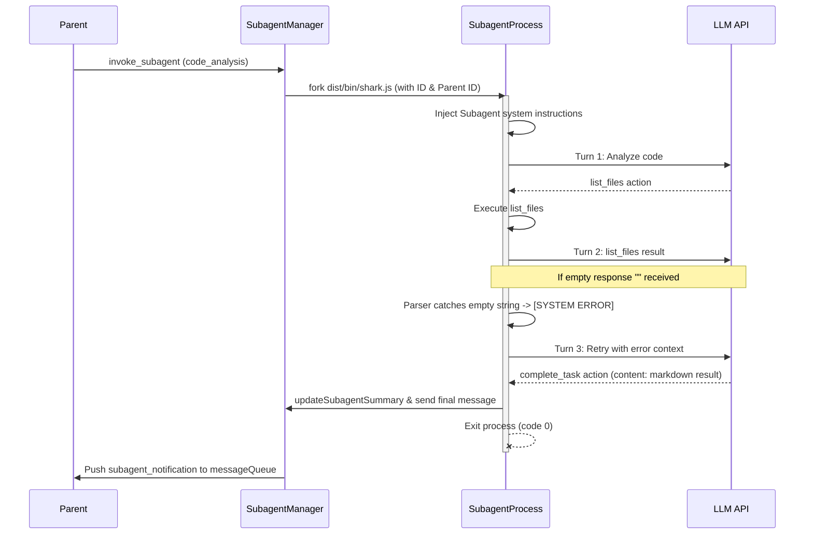

# Design Spec: Subagent Specialization and Communication

This document outlines the design for improving background subagents in Shark AI, ensuring robust error handling, specialized system instructions, and structured bi-directional communication with the parent agent.

## 1. Problem Statement

During execution analysis of `shark dev` runs with subagents, we identified the following limitations:
1. **Silent completions on API glitches/empty responses:** If an API provider (e.g. via OpenRouter) returns an empty response `""` due to rate limits or transient errors, the response parser falls back to treating it as a plain-text `talk_with_user` message. Subagents treat any `talk_with_user` as a task completion, causing them to terminate with status `COMPLETED` and an empty summary, rather than retrying or reporting failure.
2. **Summary-based communication constraints:** Subagents currently communicate their final output via the `summary` field (which is intended for a 1-sentence UI status) or `talk_with_user` content. There is no way for a subagent to return rich, structured markdown content (such as file structures, suggested code changes, or detailed analyses) to the parent.
3. **Inability to send interim updates:** Any text output (`talk_with_user`) causes immediate subagent termination. Subagents cannot send progress reports or ask questions to the parent agent without exiting.

---

## 2. Proposed Changes

### A. Parser Fixes for Empty Responses
We will modify the agent response parser to treat empty or whitespace-only responses as explicit system errors rather than plain-text messages:
1. In [agent-response-parser.ts](file:///data/data/com.termux/files/home/projetos/shark-ai/src/core/agents/agent-response-parser.ts):
   - If the raw response string, after trimming, is empty (`""`), it will return a `talk_with_user` action with content starting with `[SYSTEM ERROR]`.
   - Specifically: `[SYSTEM ERROR]: O modelo retornou uma resposta vazia. Por favor, tente novamente e forneça uma ação JSON válida.`
2. In the subagent execution loop in [developer-agent.ts](file:///data/data/com.termux/files/home/projetos/shark-ai/src/core/agents/developer-agent.ts):
   - When a system error is detected (content starts with `[SYSTEM ERROR]`), the subagent will feed the message back to the model as the next turn prompt, allowing it to recover and retry, rather than breaking the loop.

### B. Introducing the `complete_task` Action
We will introduce a dedicated action type: `complete_task`.
- **Action Schema:**
  ```typescript
  // Type additions
  'complete_task'
  
  // Fields used:
  // type: 'complete_task'
  // content: detailed results (markdown format, no length restriction except output limits)
  // summary: 1-sentence summary of the completion
  ```
- **Execution in Subagents:**
  - When a subagent executes `complete_task`, it saves the `content` as the subagent's final output, updates the subagent status to `completed`, and terminates the execution loop.
  - The final message sent to the parent's mailbox will include the full markdown results from the `content` field.
- **Backward Compatibility:**
  - For backward compatibility, subagents will still accept `talk_with_user` as a fallback completion trigger if it contains `TASK_COMPLETED:`, but `complete_task` will be the primary and recommended action.

### C. Specialized Subagent System Prompt
We will dynamically inject a subagent-specific context block into the system prompt when `isSubagent` is true:
- It will inform the model of its role as a background subagent.
- It will provide the `Parent ID` and `Subagent ID`.
- It will explicitly state that `talk_with_user` is not supported for interactive human communication.
- It will instruct the model to use `send_message` with the `Parent ID` for interim progress updates or questions.
- It will instruct the model to use `complete_task` to report final detailed results.

---

## 3. Detailed Data Flow



---

## 4. Testing Strategy

1. **Parser Tests:** Update [agent-response-parser.test.ts](file:///data/data/com.termux/files/home/projetos/shark-ai/src/core/agents/agent-response-parser.test.ts) to verify:
   - Empty/whitespace-only responses produce a `[SYSTEM ERROR]` payload.
   - `complete_task` action is successfully parsed and validated.
2. **Subagent Manager Tests:** Update [subagent-manager.test.ts](file:///data/data/com.termux/files/home/projetos/shark-ai/src/core/workflow/subagent-manager.test.ts) to verify that a subagent completing via the new protocol sends the detailed content to the parent mailbox.
3. **Developer Agent Integration Tests:** Update [developer-agent.test.ts](file:///data/data/com.termux/files/home/projetos/shark-ai/src/core/agents/developer-agent.test.ts) to mock the completion using `complete_task` and verify it exits the loop with the correct summary and final result payload.
