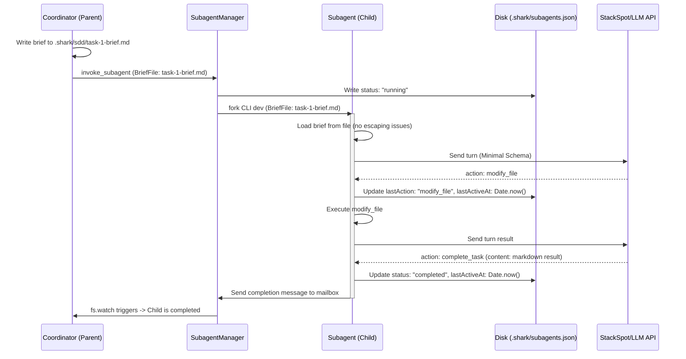

# Design Spec: Subagent Communication and Schema Optimization

This document outlines the design for optimizing communication, reducing token bloat, preventing silent execution loops, and streamlining subagent invocation in the Shark AI development environment.

## 1. Problem Statement

We identified several critical pain points in the subagent orchestration system:
1. **Context/Token Bloat (Unified Flat Schema):** Currently, a single unified JSON schema (`AGENT_RESPONSE_JSON_SCHEMA`) containing 18 tools is used for both the Coordinator and the Subagents. Because OpenAI's strict schemas force all fields to be declared as `required` (falling back to `null` if unused), subagents waste dozens of output tokens per round declaring unused orchestration fields (e.g. `"Message": null`, `"Subagents": null`).
2. **LLM Tool Confusion & Escaping Bugs:** Subagents often try to call coordinator tools (like `talk_with_user` or `wait`), despite instructions to avoid them. Additionally, passing a long prompt string to a subagent via JSON (`invoke_subagent` action) causes string-escaping bugs with newlines and double quotes.
3. **Inconsistent Nomenclatures:** The schema mixes snake_case fields (`start_anchor`, `duration_seconds`) with PascalCase/capitalized fields (`Recipient`, `Message`, `Subagents`, `ConversationIds`), confusing smaller/local models.
4. **Silent Loops and Failures:** When a subagent gets stuck in an API loop, consumes CPU/memory without writing files, or fails silently, the Coordinator has no real-time insight. The only way it knows a subagent is active is by checking if the process is running, without knowing *what* it is doing.

---

## 2. Proposed Changes

### A. Segregated JSON Schemas
We will split the unified response schema into two distinct schemas in `src/core/api/prompts.ts`:
1. **`COORDINATOR_RESPONSE_JSON_SCHEMA` (Full Schema):**
   - Keeps all 18 tools (orchestration + task-level). This ensures the parent agent remains fully autonomous and can edit files, run commands, or spawn subagents as needed.
2. **`SUBAGENT_RESPONSE_JSON_SCHEMA` (Minimal Schema):**
   - **Allowed Actions:** `read_file`, `create_file`, `modify_file`, `list_files`, `search_file`, `search_code`, `delete_file`, `run_command`, `use_mcp_tool`, `send_message`, `complete_task`.
   - **Removed Actions:** `talk_with_user`, `notify_user`, `activate_skill`, `define_subagent`, `invoke_subagent`, `manage_subagents`, `wait`.
   - Stripping these 7 actions removes unnecessary properties, drastically reducing token usage and eliminating tool confusion.

### B. Normalized snake_case Properties
For the subagent-facing communication actions, we will normalize properties to miniscule/snake_case to ensure consistency:
- `Recipient` $\rightarrow$ `recipient` (ID of the destination)
- `Message` $\rightarrow$ `message` (content string)
- `Subagents` $\rightarrow$ `subagents` (for the coordinator schema)
- `ConversationIds` $\rightarrow$ `conversation_ids` (for the coordinator schema)

The response parser/bridge will automatically map camelCase/snake_case internally for compatibility.

### C. File-Briefing Subagent Invocation
Instead of passing raw instruction strings in the JSON action payload of `invoke_subagent` (which breaks on escaping), we will transition to a file-based brief approach:
1. The Coordinator writes the subagent's task specification to a markdown file: `.shark/sdd/task-<subagent_id>-brief.md`.
2. The Coordinator calls `invoke_subagent` referencing the brief file path:
   ```json
   {
     "action": {
       "type": "invoke_subagent",
       "Subagents": [
         {
           "TypeName": "developer_agent",
           "Role": "Implementer",
           "BriefFile": ".shark/sdd/task-1-brief.md"
         }
       ]
     }
   }
   ```
3. The `SubagentManager` spawns the child process and passes the path. The subagent's harness reads the briefing file directly into its starting prompt, eliminating any JSON escaping errors.

### D. Central Subagent Ledger (`.shark/subagents.json`)
We will implement a single state ledger on disk under `.shark/subagents.json` managed by the execution harness (Coordinator & Subagent CLI wrapper). This avoids polluting the Coordinator's active memory with child state history.

#### Schema of `.shark/subagents.json`:
```json
{
  "lastUpdated": 1719958040200,
  "subagents": {
    "subagent-uuid-123": {
      "id": "subagent-uuid-123",
      "parentId": "parent",
      "type": "developer_agent",
      "role": "Implementer",
      "status": "running", // "running" | "completed" | "failed" | "cancelled" | "timeout"
      "createdAt": 1719958000000,
      "lastActiveAt": 1719958040200,
      "lastAction": {
        "tool": "ast_modify_method",
        "params": {
          "path": "src/services/auth.ts",
          "method_name": "login"
        }
      },
      "lastSummary": "Adding token expiration check",
      "error": null
    }
  }
}
```

#### Update Triggers (Harness-Driven):
1. **Spawn (Parent Coordinator):** Initializes the subagent's block in `subagents` with status `"running"`.
2. **Before Tool Execution (Child Runtime):** The child agent's tool execution wrapper intercepts the tool call (e.g. `ast_modify_method`) and writes the tool type and arguments to `lastAction` and updates `lastActiveAt = Date.now()`.
3. **LLM Turn Completion (Child Runtime):** Updates `lastSummary` with the latest `response.summary` and updates `lastActiveAt = Date.now()`.
4. **Completion/Termination (Child or Parent):** Writes `"completed"`, `"failed"`, `"cancelled"`, or `"timeout"` as the final status.

### E. Active Monitoring and Watchdog
The parent process `SubagentManager` will run an active Watchdog timer:
1. **Reactive File Watcher:** The Coordinator watches `.shark/subagents.json` via `fs.watch`. When the subagent writes an update, the Coordinator instantly wakes up/updates its local state without polling intervals.
2. **Watchdog Timeout:** If a subagent is in a `"running"` status and its `lastActiveAt` timestamp is not updated for more than **5 minutes** (configurable), the Coordinator:
   - Terminates the child process via `SIGKILL`.
   - Updates its ledger status to `"timeout"`.
   - Notifies the Coordinator message queue with `[Subagent Timeout] Subagent <Role> (<id>) failed to report activity in the last 5 minutes.`


### F. StackSpot Portal Integration & Configuration
To support two distinct system prompts and JSON schemas, users will configure two separate agents on the StackSpot AI Portal:
1. **Shark Dev (Coordinator/Parent Agent):** Uses the full system prompt (`UNIFIED_SYSTEM_PROMPT`) and `COORDINATOR_RESPONSE_JSON_SCHEMA`.
2. **Shark Dev Subagent:** Uses the new minimal system prompt (`SUBAGENT_SYSTEM_PROMPT`) and `SUBAGENT_RESPONSE_JSON_SCHEMA`.

In `.sharkrc` or the global config, we will support configuring different Agent IDs for each:
```yaml
stackspot:
  agentId: "coordinator-agent-id"       # Default for parent executions
  subagentId: "subagent-agent-id"       # Used automatically for subagent processes
```

In `src/core/api/stackspot-provider.ts`, `getAgentId()` will resolve the ID:
- If the current execution context is a subagent (detected via `process.env.SHARK_SUBAGENT_ROLE`), it returns `config.stackspot.subagentId` (falling back to the default `agentId` if not defined).
- Otherwise, it returns `config.stackspot.agentId`.

### G. CLI Commands Updates (`export-schema` and `export-prompt`)
We will update the CLI commands to support exporting the assets for either the `coordinator` or the `subagent`. To provide a premium user experience, we will support both interactive menus and direct arguments:

1. **`shark export-schema [agent-type]`**
   - **Arguments:** `agent-type` (optional). Valid values: `coordinator`, `subagent`.
   - **Behavior:**
     - **Interactive Mode (No argument passed):** Opens an interactive select menu using the TUI:
       - `Select agent type to export schema:`
         - `Coordinator / Parent Agent`
         - `Subagent`
     - **Non-Interactive Mode (Argument passed):**
       - `shark export-schema coordinator`: Prints `COORDINATOR_RESPONSE_JSON_SCHEMA`.
       - `shark export-schema subagent`: Prints `SUBAGENT_RESPONSE_JSON_SCHEMA`.

2. **`shark export-prompt [agent-type]`**
   - **Arguments:** `agent-type` (optional). Valid values: `coordinator`, `subagent`.
   - **Behavior:**
     - **Interactive Mode (No argument passed):** Opens an interactive select menu using the TUI:
       - `Select agent type to export system prompt:`
         - `Coordinator / Parent Agent`
         - `Subagent`
     - **Non-Interactive Mode (Argument passed):**
       - `shark export-prompt coordinator`: Prints `UNIFIED_SYSTEM_PROMPT`.
       - `shark export-prompt subagent`: Prints `SUBAGENT_SYSTEM_PROMPT`.

---


## 3. Data Flow




---

## 4. Verification Plan

### Automated Tests
1. **Schema Tests:** Verify that `SUBAGENT_RESPONSE_JSON_SCHEMA` doesn't contain coordinator properties and correctly enforces snake_case.
2. **Harness Tests:** Mock child process executions and verify `.shark/subagents.json` is correctly initialized, updated at each tool call/turn, and finalized.
3. **Watchdog Tests:** Mock an unresponsive child process, fast-forward time, and verify that the child process is terminated with a `timeout` status in the ledger.
