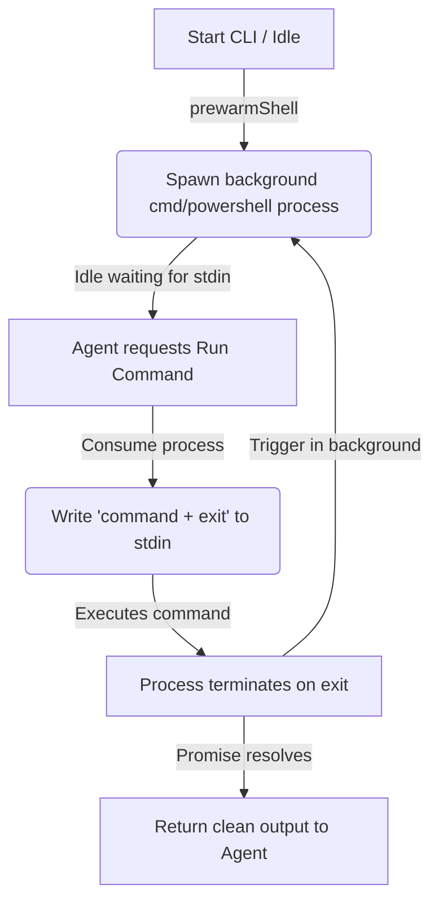

# Design Spec: Pre-warmed Shell Process Pool (Performance Optimization)

This design details the optimization of the terminal command runner tool in the Shark AI developer agent. The goal is to solve the execution latency on Windows by pre-warming shell processes in background, while keeping the executions completely stateless.

## Goal & Background

Currently, the terminal tool (`handleRunCommand` in [agent-tools.ts](file:///d:/projetos/bmadspot/src/core/agents/agent-tools.ts)) spawns a fresh `cmd.exe` or `powershell.exe` process for every command using Node's `child_process.spawn`. 
On Windows, process initialization of shells has high latency (200ms - 800ms). This delays command results significantly.

To fix this while keeping command execution completely **stateless** and **isolated** (ensuring each command starts in a fresh environment/directory), we will use a **Pre-warmed Shell Process Pool** powered by the **`execa`** library.

---

## Proposed Architecture

### 1. Pre-warming Shells
We maintain a pre-warmed shell process in the background. While the agent is "thinking" or waiting for input, the process is already initialized and idle.

### 2. Lifespan of a Process
When a command is requested:
1. We consume the pre-warmed process.
2. We write the command to its `stdin` followed by `\nexit\n` so it executes and immediately exits.
3. We capture the complete buffer from the process.
4. We immediately trigger the creation of a new pre-warmed shell process to prepare for the next command.

### 3. Delimiter-less Output Capture
By ending the input stream with `exit`, the shell process terminates naturally when it finishes the command. Execa's promise resolves, and we get the clean `stdout` and `stderr` without parsing complex delimiters.



---

## Proposed Changes

### Dependencies

#### [MODIFY] [package.json](file:///d:/projetos/bmadspot/package.json)
We need to add the `execa` dependency to the project.

```json
"dependencies": {
    "execa": "^8.0.1",
    ...
}
```

### Core Execution

#### [MODIFY] [agent-tools.ts](file:///d:/projetos/bmadspot/src/core/agents/agent-tools.ts)
Refactor `handleRunCommand` and introduce a background pre-warming mechanism.

```typescript
import { execa, type ExecaChildProcess } from 'execa';

let nextShellProcess: ExecaChildProcess | null = null;

export function prewarmShell() {
    const isWindows = process.platform === 'win32';
    const shell = isWindows 
        ? (process.env.COMSPEC || 'cmd.exe') 
        : (process.env.SHELL || 'sh');

    nextShellProcess = execa(shell, [], {
        stdin: 'pipe',
        stdout: 'pipe',
        stderr: 'pipe',
        reject: false,
        buffer: true,
        cwd: process.cwd(),
        env: process.env
    });
}

export async function handleRunCommand(command: string): Promise<string> {
    tui.log.info(`💻 Executing: ${colors.dim(command)}`);

    // Grab the pre-warmed shell or initialize if missing
    if (!nextShellProcess) {
        prewarmShell();
    }
    const currentShell = nextShellProcess!;

    // Instantly spawn a new one in background for the next call
    prewarmShell();

    try {
        // Send command and exit
        currentShell.stdin?.write(`${command}\nexit\n`);

        // Wait for execution completion
        const { stdout, stderr } = await currentShell;

        const output = stdout.trim() || stderr.trim();
        return output || 'Command executed successfully (no output).';
    } catch (e: any) {
        return `Error executing command: ${e.message}`;
    }
}
```

---

## Verification Plan

### Automated Verification
* Verify that the CLI compiles successfully with the new `execa` dependency.
* Add unit tests in `developer-agent.test.ts` to mock `handleRunCommand` or verify pre-warming.

### Manual Verification
* Run command executions under different environments (Windows / Linux) and measure execution latency.
* Verify that successive commands are stateless (e.g. running `cd src` followed by `git status` in a separate call should show that the second call is still in the root directory, not `src`).
